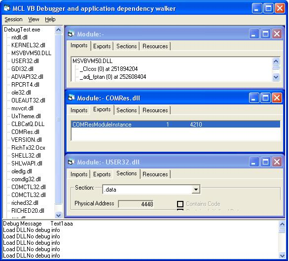

## VB Debugger/dependency viewer 0\.2

### Description

Purpose:

----

A tool to allow you to attach a debugger to a process and be notified when debug events (such as a thread starting, a dll unloading etc.) occur and optionally to pause that application on such an event.

Demonstrates:

----

Using the windows API to attach to a process and read it's memory
 
### More Info
 
Use:

----

Firstly set the events (if any) that you want the application being debugged to be paused on.

Then select an application to debug - you can either select from the list of already running applications,

or browse for an application to launch under the control of the debugger.

As the debug events occur the details will appear in the bottom pane. If you have selected to freeze the debugee application then you will have to press the "Continue" menu when you want to let it continue.

The modules list in the right hand pane will be filled as modules load. To get extra information about a given module (for exampl,e the imports and exports listing) double click on it and a form will open for each running module.

             |
---                |---
**Submitted On**   |2002-12-18 23:03:22
**By**             |[Duncan Jones](https://github.com/Planet-Source-Code/PSCIndex/blob/master/ByAuthor/duncan-jones.md)
**Level**          |Advanced
**User Rating**    |5.0 (15 globes from 3 users)
**Compatibility**  |VB 5\.0, VB 6\.0
**Category**       |[Windows API Call/ Explanation](https://github.com/Planet-Source-Code/PSCIndex/blob/master/ByCategory/windows-api-call-explanation__1-39.md)
**World**          |[Visual Basic](https://github.com/Planet-Source-Code/PSCIndex/blob/master/ByWorld/visual-basic.md)
**Archive File**   |[VB\_Debugge15155812192002\.zip](https://github.com/Planet-Source-Code/duncan-jones-vb-debugger-dependency-viewer-0-2__1-41711/archive/master.zip)

